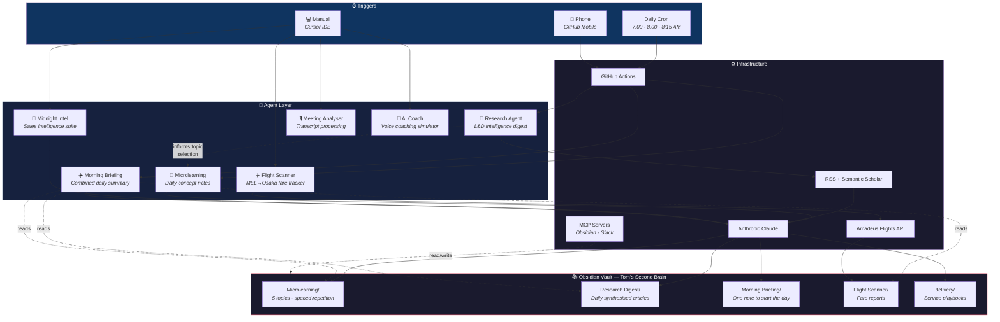

# How I Use AI Agents in My Personal Life

I've built a personal agent ecosystem — a collection of AI-powered automations that quietly run in the background, feeding curated knowledge, intelligence, and utility into my Obsidian vault every day. The result is a "second brain" that grows on its own.

This is the story of how it works.

---

## The System at a Glance



---

## What Happens Every Day

Here's what a typical morning looks like — all of it without me touching anything:

| Time | What happens | Agent | How |
|------|-------------|-------|-----|
| **7:00 AM** | A microlearning note appears on one of 5 topics, informed by yesterday's research | Microlearning Agent | GitHub Actions |
| **8:00 AM** | A research digest synthesises the latest from 20+ RSS feeds and academic sources | Research Agent | GitHub Actions |
| **8:15 AM** | A morning briefing combines all agent outputs into a single 2-minute read | Morning Briefing | GitHub Actions |
| **When needed** | I scan Melbourne→Osaka flights and get a fare report with price trends | Flight Scanner | Manual trigger |
| **When needed** | I research a prospect, scan for buying signals, or generate LinkedIn content | Midnight Intel | Manual trigger |

By the time I open Obsidian on my phone, there are three fresh notes waiting — and one of them is a briefing that summarises the other two.

---

## The Agents

### 🧠 Microlearning Agent — "Learn something new every day"

**What:** Generates one structured microlearning note per day across five topics I'm fascinated by: Learning Science, Behavioural Economics, Complexity Theory, AI Management, and Strategy.

**Why it's clever:** It doesn't just generate random content. It uses learning science principles *about* learning:

- **Spaced repetition** — tracks every concept and schedules retrieval challenges at expanding intervals (1, 3, 7, 14, 30 days)
- **Interleaving** — rotates topics weighted toward least-covered areas, avoiding back-to-back repeats
- **Cross-domain bridging** — every note connects its concept to a different topic, building transfer
- **Retrieval practice** — includes questions about past concepts that require genuine recall
- **Research-informed** — reads the latest research digest and boosts topics that connect to current events and trends

**Runs:** Daily at 7:00 AM via GitHub Actions. Also triggerable from the GitHub Mobile app on my phone.

**Output:** `Microlearning/<Topic>/YYYY-MM-DD-<concept>.md`

---

### 📰 Research Agent — "Stay current without doomscrolling"

**What:** Scans 20+ RSS feeds (Microsoft Copilot, Workday, Cursor, Udemy, HBR, ATD, MIT Tech Review, OpenAI) and Semantic Scholar for academic papers on workplace learning. Claude synthesises the findings into a readable 800–1200 word article.

**Why it matters:** As a Learning Ecosystem Manager, I need to stay across tooling updates, AI developments, and human development research. This agent replaces 45 minutes of manual feed reading with a single curated article.

**Runs:** Daily at 8:00 AM via GitHub Actions. Also triggerable manually with a configurable lookback window.

**Output:** `Research Digest/Research Digest YYYY-MM-DD.md`

---

### ☀️ Morning Briefing — "One note to start the day"

**What:** Reads the output of every other agent and produces a single 2-minute morning summary. Includes today's microlearning concept, key research takeaways, any flight scan updates, and concepts due for spaced repetition review — tied together with a "throughline" connecting the day's themes.

**Why it matters:** Instead of opening three different folders, I open one note and I'm caught up.

**Runs:** Daily at 8:15 AM via GitHub Actions (after microlearning and research have completed).

**Output:** `Morning Briefing/YYYY-MM-DD-morning-briefing.md`

---

### ✈️ Flight Scanner — "Never miss a good deal to Japan"

**What:** Tracks Melbourne (MEL) → Osaka (KIX) airfares across 8 weeks of departure dates. Generates search links for Google Flights, Skyscanner, and Kayak. Alerts when prices drop below threshold or significantly from the previous week.

**Runs:** Weekly, manually triggered. Results go to both the vault and a standalone HTML dashboard.

**Output:** `Flight Scanner/Flight Scan YYYY-MM-DD.md` + `fare_dashboard.html`

---

### 💼 Midnight Intel — "Business intelligence on demand"

**What:** A five-tool intelligence suite for my consultancy (Midnight Labs):

1. **Account Research** — pre-call briefs on target companies with L&D fit assessment
2. **Signal Monitor** — scans for L&D buying signals across APAC
3. **Playbook Builder** — builds and maintains a living strategic playbook
4. **Delivery Playbooks** — operational guides for each service line
5. **LinkedIn Content** — generates a week of posts grounded in real intelligence

**Runs:** On demand via CLI or Streamlit dashboard.

**Output:** Briefs, playbooks, and content in `delivery/` and local output folders.

---

### 🎙️ Meeting Analyser — "Never lose an action item"

**What:** Processes Zoom meeting transcripts through a local LLM (Ollama). Extracts summaries, action items, and daily reports. Runs entirely on-device — no data leaves my machine.

**Runs:** On demand via REST API.

---

### 🎯 NAB AI Coach — "Practice difficult conversations"

**What:** A real-time voice coaching simulator. Multi-agent orchestration (coach, customer, employee personas) for practising customer callback scenarios. Uses text-to-speech for natural conversation flow.

**Runs:** On demand via local web app.

---

## How the Agents Talk to Each Other

One of the most powerful aspects of this system is that the agents aren't siloed — they inform each other:

```
Research Digest  ──→  Microlearning Agent
   (8:00 AM)            (7:00 AM next day)
                         │
                         │  "Yesterday's digest covered AI-driven
                         │   skills taxonomies — boost AI Management
                         │   topic weight, include digest context
                         │   in the prompt"
                         ▼
                    Today's microlearning note
                    connects to current events
                         │
                         ▼
Morning Briefing  ←──  reads both outputs
   (8:15 AM)           + flight scans
                       + spaced repetition schedule
                         │
                         ▼
                    One note to start the day
```

The microlearning agent reads the latest research digest before generating a note. It does two things:

1. **Boosts topic weights** — if the digest is heavy on AI content, the agent is more likely to pick AI Management
2. **Passes context to the prompt** — so Claude picks concepts that connect to what's happening in the real world right now

The result: microlearning that feels timely, not random.

---

## The Infrastructure

### Cursor IDE + MCP

[Cursor](https://cursor.sh) is my AI-powered IDE. It's where I build and maintain the agents. Two MCP (Model Context Protocol) servers extend its reach:

- **Obsidian MCP** — lets Cursor read and write directly to my vault. I can say *"update the Agents Directory"* and it modifies the note in real time.
- **Slack MCP** — connects Cursor to Slack for messaging and search.

### GitHub Actions

Three workflows run on daily schedules — all via GitHub Actions, a free CI/CD pipeline that executes Python in the cloud. The repo syncs to my vault via the Obsidian Git plugin. This means:

- Agents run even when my laptop is off
- I can trigger any workflow from my phone via the GitHub Mobile app
- Everything is version-controlled — I can see exactly what changed and when

### Anthropic Claude

All agents use Claude for synthesis and generation. Claude is the "brain" behind the microlearning notes, research digests, and morning briefings. The API key is stored as a GitHub secret — never in code.

### Obsidian as the "Second Brain"

Everything converges in Obsidian — a local-first markdown knowledge base. Agents write to designated folders, and I read their output alongside my own notes. The vault syncs across devices via OneDrive (personal notes) and Git (agent-generated content).

```
Tom's Vault/
├── Morning Briefing/      ← ☀️ Start here (daily, automated)
├── Microlearning/         ← 🧠 Microlearning Agent (daily, automated)
│   ├── Learning Science/
│   ├── Behavioural Economics/
│   ├── Complexity Theory/
│   ├── AI Management/
│   └── Strategy/
├── Research Digest/       ← 📰 Research Agent (daily, automated)
├── Flight Scanner/        ← ✈️ Flight Scanner (weekly, manual)
├── delivery/              ← 💼 Midnight Intel playbooks
├── Knowledge/             ← Reference materials
└── Agents Directory.md    ← Index of the whole system
```

---

## Design Principles

A few ideas that shaped how I built this:

1. **Agents should deliver, not distract.** Output goes into my vault — I read it when I'm ready. No push notifications, no real-time feeds, no Slack pings.

2. **Automate the predictable, trigger the unpredictable.** Research and learning run on cron. Sales intelligence and flight scans run when I need them.

3. **Use learning science on yourself.** The microlearning agent doesn't just generate content — it implements spaced repetition, interleaving, and retrieval practice. The medium *is* the message.

4. **Let agents inform each other.** The research digest feeds into microlearning topic selection. The morning briefing reads from all agents. The system is greater than the sum of its parts.

5. **Local first, cloud where it helps.** Meeting analysis runs entirely on-device. Learning notes run in the cloud for mobile access. Each agent uses the right architecture for its job.

6. **The vault is the interface.** I don't check six different dashboards. Everything flows into one place — Obsidian — where it connects to everything else I know.

---

## What's Next

- Connecting the Slack MCP to route agent outputs to team channels
- An **Obsidian Gardener** agent that suggests `[[wikilinks]]` between notes and identifies knowledge gaps
- **Learning Analytics** — weekly reports on learning trajectory and topic coverage
- **Network Intelligence** — cross-referencing LinkedIn connections with Midnight Intel buying signals

---

*Built with Cursor, Claude, GitHub Actions, and too many late nights.*
